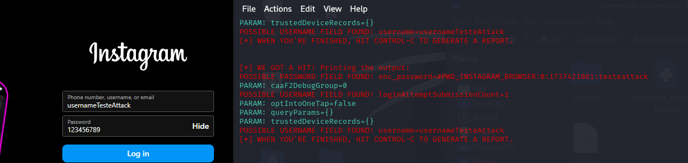

# Teste de Ataque de Phishing

Este repositório foi criado para execução de um desafio de código no Bootcamp de Cibersegurança da DIO.

O projeto teve por objetivo criar uma página falsa para coleta de usuário e senha de uma rede social com a ferramenta setoolkit. 

Para este caso foi utilizado o Instagram como alvo.

## Passo a Passo

Acessando a máquina Kali Linux, é necessário logar como root através do comando: sudo su

Em seguida acesse a ferramenta com o comando: setoolkit

Na sequência escolha as seguintes opções:

- Tipo de ataque: Social-Engineering Attacks - Selecione 1 no terminal
- Vetor de ataque: Web Site Attack Vectors - Selecione 2 no terminal
- Método de ataque: Credential Harvester Attack Method - Selecione 3 no terminal
- Método de ataque: Site Cloner - Selecione 2 no terminal

Na escolha do IP de hospedagem, mantive o IP da máquina pois fiz sua configuração em modo Bridge.

Em seguida é adicionada a página alvo, neste caso: http://www.instagram.com

Quando finalizar a criação, acesse na máquina real ou outra máquina conectada, o IP escolhido para hospedagem e digite um usuário e uma senha para testar a captura.

## Resultado

